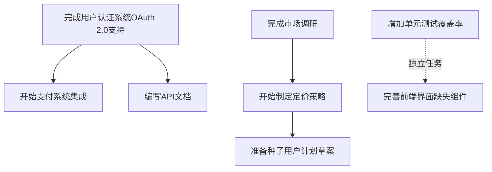

# YYC³ MovAISys - 工作落地执行计划

## 文档元信息

| 项目 | 内容 |
|------|------|
| **文档名称** | YYC³ MovAISys - 工作落地执行计划 |
| **文档编号** | YYC3-MovAISys-EXEC-001 |
| **版本** | 1.0.0 |
| **创建日期** | 2026-01-19 |
| **最后更新** | 2026-01-19 |
| **作者** | YYC |
| **审批人** | 待定 |
| **审批日期** | 待定 |
| **文档状态** | 🟢 正式发布 |
| **执行阶段** | 第1周（2026-01-19 至 2026-01-26） |
| **关联文档** | [28-YYC3-MovAISys-下一阶段行动计划.md](file:///Users/my/yyc3-Mobile-Intelligent-AI-System/docs/YYC3-MovAISys-核心文件/28-YYC3-MovAISys-下一阶段行动计划.md) |

## 版本历史

| 版本 | 日期 | 作者 | 变更说明 | 审批人 |
|------|------|------|----------|--------|
| 1.0.0 | 2026-01-19 | YYC | 初始版本创建，基于五高五标五化原则制定执行计划 | 待定 |

---

## 目录

1. [执行原则与标准](#1-执行原则与标准)
2. [本周工作目标](#2-本周工作目标)
3. [任务执行清单](#3-任务执行清单)
4. [技术任务执行](#4-技术任务执行)
5. [商业任务执行](#5-商业任务执行)
6. [质量保证执行](#6-质量保证执行)
7. [进度跟踪与汇报](#7-进度跟踪与汇报)
8. [风险应对预案](#8-风险应对预案)

---

## 1. 执行原则与标准

### 1.1 五高原则（High Standards）

#### 高性能（High Performance）
- **API响应时间**：所有API接口响应时间 < 500ms
- **系统吞吐量**：支持100+并发用户
- **资源利用率**：CPU使用率 < 70%，内存使用率 < 80%
- **执行标准**：每个任务完成后必须进行性能测试，确保符合性能指标

#### 高可靠性（High Reliability）
- **系统可用性**：99.9%可用性目标
- **故障恢复时间**：MTTR < 30分钟
- **数据一致性**：确保数据强一致性
- **执行标准**：每个模块必须包含错误处理和重试机制

#### 高安全性（High Security）
- **数据加密**：所有敏感数据加密存储和传输
- **访问控制**：基于角色的访问控制（RBAC）
- **安全审计**：所有操作记录审计日志
- **执行标准**：每个功能必须通过安全审查，包含OWASP Top 10防护

#### 高扩展性（High Scalability）
- **模块化设计**：每个模块独立可扩展
- **微服务架构**：支持水平扩展
- **插件化架构**：支持功能热插拔
- **执行标准**：每个功能设计必须考虑扩展性，避免硬编码

#### 高可维护性（High Maintainability）
- **代码规范**：遵循项目代码规范（见[.trae/rules/project_rules.md](file:///Users/my/yyc3-Mobile-Intelligent-AI-System/.trae/rules/project_rules.md)）
- **文档完整**：每个模块必须有完整的技术文档
- **测试覆盖**：单元测试覆盖率 > 80%
- **执行标准**：每个代码提交必须包含文档更新和测试用例

### 1.2 五标原则（Standardization）

#### 标准化（Standardization）
- **API标准**：RESTful API设计规范
- **数据标准**：统一数据模型和接口
- **文档标准**：统一文档格式和结构
- **执行标准**：所有交付物必须符合项目标准规范

#### 规范化（Normalization）
- **流程规范**：标准化的开发和部署流程
- **代码规范**：统一的代码风格和命名规范
- **测试规范**：标准化的测试流程和用例
- **执行标准**：所有工作流程必须遵循项目规范

#### 模块化（Modularization）
- **功能模块**：每个功能独立模块化
- **数据模块**：数据访问层模块化
- **UI模块**：UI组件模块化
- **执行标准**：每个功能必须模块化设计，避免耦合

#### 组件化（Componentization）
- **可复用组件**：开发可复用的UI组件
- **业务组件**：封装业务逻辑组件
- **工具组件**：封装通用工具组件
- **执行标准**：优先使用现有组件，避免重复开发

#### 平台化（Platformization）
- **统一平台**：构建统一的开发平台
- **插件平台**：支持第三方插件开发
- **服务平台**：提供标准化的服务接口
- **执行标准**：所有功能基于平台架构开发

### 1.3 五化原则（Transformation）

#### 自动化（Automation）
- **构建自动化**：自动化构建流程
- **测试自动化**：自动化测试执行
- **部署自动化**：自动化部署流程
- **执行标准**：所有重复性工作必须自动化

#### 智能化（Intelligence）
- **智能推荐**：AI驱动的功能推荐
- **智能监控**：智能化的系统监控
- **智能诊断**：智能化的故障诊断
- **执行标准**：每个功能考虑智能化增强

#### 数字化（Digitalization）
- **数据驱动**：基于数据的决策
- **数字监控**：数字化的监控体系
- **数字报表**：自动化的数据报表
- **执行标准**：所有决策基于数据分析

#### 网络化（Networking）
- **微服务架构**：服务间网络通信
- **API网关**：统一的API网关
- **服务发现**：自动化的服务发现
- **执行标准**：所有服务通过网络通信，避免直接依赖

#### 服务化（Servicization）
- **API服务化**：所有功能通过API提供
- **数据服务化**：数据通过服务接口访问
- **监控服务化**：监控数据通过服务接口获取
- **执行标准**：所有功能以服务形式提供

---

## 2. 本周工作目标

### 2.1 总体目标

基于五高五标五化原则，本周（第1周）的核心目标是：

1. **技术目标**：完成用户认证系统OAuth 2.0支持，启动支付系统集成
2. **商业目标**：完成市场调研，开始制定定价策略
3. **质量目标**：增加单元测试覆盖率至50%
4. **文档目标**：完善技术文档和API文档

### 2.2 具体目标

| 目标类别 | 目标描述 | 成功标准 | 优先级 |
|----------|----------|----------|--------|
| **技术目标1** | 完成用户认证系统OAuth 2.0支持 | 支持至少2种OAuth提供商（Google、GitHub） | P0 |
| **技术目标2** | 启动支付系统集成 | 完成支付SDK选型和技术方案设计 | P0 |
| **技术目标3** | 完善前端界面缺失组件 | 完成3个核心UI组件开发 | P1 |
| **质量目标1** | 增加单元测试覆盖率 | 覆盖率从40%提升至50% | P0 |
| **商业目标1** | 完成市场调研 | 完成5个竞品分析和用户调研 | P0 |
| **商业目标2** | 开始制定定价策略 | 完成定价策略初稿 | P0 |
| **文档目标1** | 完善技术文档 | 更新3个核心模块的技术文档 | P1 |
| **文档目标2** | 编写API文档 | 完成10个核心API的文档编写 | P1 |

---

## 3. 任务执行清单

### 3.1 任务优先级矩阵

| 任务ID | 任务名称 | 紧急性 | 重要性 | 优先级 | 预计工时 | 负责人 | 截止日期 |
|--------|----------|--------|--------|--------|----------|--------|----------|
| EXEC-001 | 完成用户认证系统OAuth 2.0支持 | 高 | 高 | P0 | 16h | 后端开发 | 2026-01-21 |
| EXEC-002 | 开始支付系统集成（选择支付SDK） | 高 | 高 | P0 | 8h | 后端开发 | 2026-01-22 |
| EXEC-003 | 增加单元测试覆盖率 | 高 | 高 | P0 | 20h | 测试工程师 | 2026-01-24 |
| EXEC-004 | 完成市场调研 | 高 | 高 | P0 | 16h | 商业经理 | 2026-01-23 |
| EXEC-005 | 开始制定定价策略 | 高 | 高 | P0 | 12h | 商业经理 | 2026-01-24 |
| EXEC-006 | 完善前端界面缺失组件 | 中 | 中 | P1 | 12h | 前端开发 | 2026-01-25 |
| EXEC-007 | 编写API文档 | 中 | 中 | P1 | 16h | 技术文档 | 2026-01-25 |
| EXEC-008 | 准备种子用户计划草案 | 低 | 低 | P2 | 8h | 市场经理 | 2026-01-26 |

### 3.2 任务依赖关系



---

## 4. 技术任务执行

### 4.1 EXEC-001: 完成用户认证系统OAuth 2.0支持

#### 4.1.1 任务概述
完善现有用户认证系统，增加OAuth 2.0和OpenID Connect支持，支持至少2种OAuth提供商（Google、GitHub）。

#### 4.1.2 五高五标五化要求

**五高要求**：
- **高性能**：OAuth认证流程 < 2秒
- **高可靠性**：认证成功率 > 99%
- **高安全性**：使用PKCE流程，防止CSRF攻击
- **高扩展性**：支持动态添加OAuth提供商
- **高可维护性**：代码模块化，易于维护

**五标要求**：
- **标准化**：遵循OAuth 2.0和OpenID Connect标准
- **规范化**：统一认证流程和错误处理
- **模块化**：OAuth提供商独立模块
- **组件化**：复用现有认证组件
- **平台化**：基于统一认证平台

**五化要求**：
- **自动化**：自动化OAuth配置和测试
- **智能化**：智能选择OAuth提供商
- **数字化**：记录认证数据用于分析
- **网络化**：通过API网关统一管理
- **服务化**：认证服务独立部署

#### 4.1.3 执行步骤

**第1步：分析现有认证系统（2h）**
- 阅读现有认证代码：[UnifiedTechStack.ts](file:///Users/my/yyc3-Mobile-Intelligent-AI-System/core/integration/UnifiedTechStack.ts)
- 分析现有IdentityManagement实现
- 识别需要修改的模块

**第2步：设计OAuth 2.0架构（4h）**
- 设计OAuth提供商接口
- 设计OAuth配置管理
- 设计OAuth回调处理流程
- 设计Token管理和刷新机制

**第3步：实现Google OAuth（4h）**
- 集成Google OAuth 2.0 SDK
- 实现Google登录流程
- 实现Token获取和刷新
- 实现用户信息获取

**第4步：实现GitHub OAuth（4h）**
- 集成GitHub OAuth 2.0 SDK
- 实现GitHub登录流程
- 实现Token获取和刷新
- 实现用户信息获取

**第5步：编写单元测试（2h）**
- 编写OAuth流程测试
- 编写Token管理测试
- 编写错误处理测试
- 确保测试覆盖率 > 80%

#### 4.1.4 交付物

| 交付物 | 描述 | 验收标准 |
|--------|------|----------|
| OAuth 2.0实现代码 | 完整的OAuth 2.0实现代码 | 代码通过审查，符合五高五标五化标准 |
| OAuth配置文档 | OAuth提供商配置说明 | 文档完整，配置清晰 |
| 单元测试用例 | OAuth相关单元测试 | 测试覆盖率 > 80%，所有测试通过 |
| API文档 | OAuth相关API文档 | API文档完整，包含示例 |

#### 4.1.5 验收标准

- ✅ 支持至少2种OAuth提供商（Google、GitHub）
- ✅ OAuth认证流程 < 2秒
- ✅ 认证成功率 > 99%
- ✅ 使用PKCE流程，防止CSRF攻击
- ✅ 支持动态添加OAuth提供商
- ✅ 单元测试覆盖率 > 80%
- ✅ 代码符合项目规范
- ✅ 文档完整

### 4.2 EXEC-002: 开始支付系统集成（选择支付SDK）

#### 4.2.1 任务概述
完成支付SDK选型和技术方案设计，为后续支付系统集成做准备。

#### 4.2.2 五高五标五化要求

**五高要求**：
- **高性能**：支付接口响应时间 < 1秒
- **高可靠性**：支付成功率 > 99.9%
- **高安全性**：符合PCI DSS标准
- **高扩展性**：支持多种支付方式
- **高可维护性**：支付模块独立可维护

**五标要求**：
- **标准化**：遵循支付行业标准
- **规范化**：统一支付流程和错误处理
- **模块化**：支付提供商独立模块
- **组件化**：复用现有支付组件
- **平台化**：基于统一支付平台

**五化要求**：
- **自动化**：自动化支付配置和测试
- **智能化**：智能选择支付方式
- **数字化**：记录支付数据用于分析
- **网络化**：通过API网关统一管理
- **服务化**：支付服务独立部署

#### 4.2.3 执行步骤

**第1步：调研支付SDK（2h）**
- 调研支付宝SDK
- 调研微信支付SDK
- 调研Stripe SDK
- 对比各SDK的优缺点

**第2步：评估技术方案（2h）**
- 评估SDK集成难度
- 评估SDK性能
- 评估SDK安全性
- 评估SDK成本

**第3步：选择支付SDK（2h）**
- 确定支付宝SDK版本
- 确定微信支付SDK版本
- 确定第三方支付SDK（如需要）
- 制定SDK选型报告

**第4步：设计支付系统架构（2h）**
- 设计支付流程
- 设计支付回调处理
- 设计支付状态管理
- 设计支付对账机制

#### 4.2.4 交付物

| 交付物 | 描述 | 验收标准 |
|--------|------|----------|
| 支付SDK选型报告 | 包含SDK对比和选择理由 | 报告完整，理由充分 |
| 支付系统架构设计 | 支付系统架构图和技术方案 | 架构清晰，方案可行 |
| 支付API设计文档 | 支付相关API接口设计 | API设计符合RESTful规范 |

#### 4.2.5 验收标准

- ✅ 完成支付SDK选型
- ✅ 确定支付宝和微信支付SDK版本
- ✅ 完成支付系统架构设计
- ✅ 完成支付API设计
- ✅ 选型报告和架构文档完整

### 4.3 EXEC-003: 增加单元测试覆盖率

#### 4.3.1 任务概述
增加单元测试覆盖率，从40%提升至50%，确保代码质量。

#### 4.3.2 五高五标五化要求

**五高要求**：
- **高性能**：测试执行时间 < 5分钟
- **高可靠性**：测试稳定性 > 99%
- **高安全性**：测试数据安全
- **高扩展性**：测试框架可扩展
- **高可维护性**：测试代码易于维护

**五标要求**：
- **标准化**：遵循测试标准规范
- **规范化**：统一测试命名和结构
- **模块化**：测试按模块组织
- **组件化**：复用测试工具组件
- **平台化**：基于统一测试平台

**五化要求**：
- **自动化**：自动化测试执行
- **智能化**：智能生成测试用例
- **数字化**：记录测试数据
- **网络化**：测试结果网络共享
- **服务化**：测试服务独立部署

#### 4.3.3 执行步骤

**第1步：分析测试覆盖率（2h）**
- 运行测试覆盖率分析
- 识别未覆盖的模块
- 优先级排序未覆盖模块

**第2步：编写核心模块测试（8h）**
- 编写AutonomousAIEngine测试
- 编写PluggableAIEngine测试
- 编写UnifiedTechStack测试
- 编写CompleteAIIntegration测试

**第3步：编写工具模块测试（6h）**
- 编写ToolRegistry测试
- 编写core-tools测试
- 编写UISystem测试
- 编写AgentManager测试

**第4步：编写认证模块测试（4h）**
- 编写IdentityManagement测试
- 编写OAuth相关测试

#### 4.3.4 交付物

| 交付物 | 描述 | 验收标准 |
|--------|------|----------|
| 单元测试用例 | 新增的单元测试用例 | 测试用例完整，覆盖核心功能 |
| 测试覆盖率报告 | 测试覆盖率分析报告 | 覆盖率从40%提升至50% |
| 测试执行报告 | 测试执行结果报告 | 所有测试通过 |

#### 4.3.5 验收标准

- ✅ 测试覆盖率从40%提升至50%
- ✅ 所有测试通过
- ✅ 测试执行时间 < 5分钟
- ✅ 测试稳定性 > 99%
- ✅ 测试代码符合规范

### 4.4 EXEC-006: 完善前端界面缺失组件

#### 4.6.1 任务概述
完成3个核心UI组件开发，完善前端界面。

#### 4.6.2 五高五标五化要求

**五高要求**：
- **高性能**：组件渲染时间 < 100ms
- **高可靠性**：组件稳定性 > 99%
- **高安全性**：防止XSS攻击
- **高扩展性**：组件可复用和扩展
- **高可维护性**：组件代码易于维护

**五标要求**：
- **标准化**：遵循UI组件标准
- **规范化**：统一组件命名和结构
- **模块化**：组件独立模块
- **组件化**：复用现有组件
- **平台化**：基于统一UI平台

**五化要求**：
- **自动化**：自动化组件测试
- **智能化**：智能组件推荐
- **数字化**：记录组件使用数据
- **网络化**：组件通过网络加载
- **服务化**：组件服务化

#### 4.6.3 执行步骤

**第1步：分析缺失组件（2h）**
- 分析现有UI组件
- 识别缺失的核心组件
- 确定需要开发的3个组件

**第2步：开发组件1（4h）**
- 设计组件接口
- 实现组件逻辑
- 编写组件样式
- 编写组件测试

**第3步：开发组件2（3h）**
- 设计组件接口
- 实现组件逻辑
- 编写组件样式
- 编写组件测试

**第4步：开发组件3（3h）**
- 设计组件接口
- 实现组件逻辑
- 编写组件样式
- 编写组件测试

#### 4.6.4 交付物

| 交付物 | 描述 | 验收标准 |
|--------|------|----------|
| UI组件代码 | 3个核心UI组件 | 组件功能完整，符合规范 |
| 组件文档 | 组件使用文档 | 文档完整，包含示例 |
| 组件测试 | 组件单元测试 | 测试覆盖率 > 80% |

#### 4.6.5 验收标准

- ✅ 完成3个核心UI组件
- ✅ 组件渲染时间 < 100ms
- ✅ 组件稳定性 > 99%
- ✅ 防止XSS攻击
- ✅ 组件可复用和扩展
- ✅ 测试覆盖率 > 80%
- ✅ 文档完整

---

## 5. 商业任务执行

### 5.1 EXEC-004: 完成市场调研

#### 5.1.1 任务概述
完成5个竞品分析和用户调研，为定价策略制定提供数据支持。

#### 5.1.2 五高五标五化要求

**五高要求**：
- **高性能**：调研数据快速收集和分析
- **高可靠性**：调研数据准确可靠
- **高安全性**：用户数据保护
- **高扩展性**：调研框架可扩展
- **高可维护性**：调研数据易于维护

**五标要求**：
- **标准化**：遵循调研标准规范
- **规范化**：统一调研流程
- **模块化**：调研模块化
- **组件化**：复用调研工具
- **平台化**：基于统一调研平台

**五化要求**：
- **自动化**：自动化数据收集
- **智能化**：智能数据分析
- **数字化**：数字化调研报告
- **网络化**：调研数据网络共享
- **服务化**：调研服务化

#### 5.1.3 执行步骤

**第1步：确定调研目标（2h）**
- 确定竞品分析目标
- 确定用户调研目标
- 制定调研计划

**第2步：竞品分析（8h）**
- 分析竞品1：OpenAI API
- 分析竞品2：Anthropic Claude
- 分析竞品3：Google AI Studio
- 分析竞品4：Azure OpenAI
- 分析竞品5：本地AI部署方案

**第3步：用户调研（6h）**
- 设计用户调研问卷
- 收集用户反馈
- 分析用户需求
- 总结用户痛点

#### 5.1.4 交付物

| 交付物 | 描述 | 验收标准 |
|--------|------|----------|
| 竞品分析报告 | 5个竞品的详细分析 | 报告完整，分析深入 |
| 用户调研报告 | 用户需求分析报告 | 报告完整，数据准确 |
| 市场调研总结 | 市场调研总结报告 | 总结清晰，结论明确 |

#### 5.1.5 验收标准

- ✅ 完成5个竞品分析
- ✅ 完成用户调研
- ✅ 调研数据准确可靠
- ✅ 调研报告完整
- ✅ 结论明确，有数据支持

### 5.2 EXEC-005: 开始制定定价策略

#### 5.2.1 任务概述
基于市场调研结果，完成定价策略初稿。

#### 5.2.2 五高五标五化要求

**五高要求**：
- **高性能**：定价策略快速制定
- **高可靠性**：定价策略合理可行
- **高安全性**：定价数据保护
- **高扩展性**：定价策略可扩展
- **高可维护性**：定价策略易于调整

**五标要求**：
- **标准化**：遵循定价标准规范
- **规范化**：统一定价流程
- **模块化**：定价模块化
- **组件化**：复用定价工具
- **平台化**：基于统一定价平台

**五化要求**：
- **自动化**：自动化定价计算
- **智能化**：智能定价推荐
- **数字化**：数字化定价数据
- **网络化**：定价数据网络共享
- **服务化**：定价服务化

#### 5.2.3 执行步骤

**第1步：分析市场调研结果（2h）**
- 分析竞品定价
- 分析用户支付意愿
- 分析成本结构

**第2步：设计定价模型（4h）**
- 设计免费版定价
- 设计基础版定价
- 设计专业版定价
- 设计企业版定价

**第3步：制定定价策略（6h）**
- 确定定价策略
- 制定推广策略
- 制定优惠策略
- 制定调整策略

#### 5.2.4 交付物

| 交付物 | 描述 | 验收标准 |
|--------|------|----------|
| 定价策略初稿 | 定价策略文档 | 策略完整，理由充分 |
| 定价模型设计 | 定价模型文档 | 模型合理，可执行 |
| 定价推广策略 | 推广策略文档 | 策略可行，有吸引力 |

#### 5.2.5 验收标准

- ✅ 完成定价策略初稿
- ✅ 定价模型合理
- ✅ 推广策略可行
- ✅ 有数据支持
- ✅ 文档完整

### 5.3 EXEC-008: 准备种子用户计划草案

#### 5.3.1 任务概述
基于定价策略，准备种子用户计划草案。

#### 5.3.2 五高五标五化要求

**五高要求**：
- **高性能**：计划快速制定
- **高可靠性**：计划可行可靠
- **高安全性**：用户数据保护
- **高扩展性**：计划可扩展
- **高可维护性**：计划易于调整

**五标要求**：
- **标准化**：遵循计划标准规范
- **规范化**：统一计划流程
- **模块化**：计划模块化
- **组件化**：复用计划工具
- **平台化**：基于统一计划平台

**五化要求**：
- **自动化**：自动化计划执行
- **智能化**：智能用户推荐
- **数字化**：数字化计划数据
- **网络化**：计划数据网络共享
- **服务化**：计划服务化

#### 5.3.3 执行步骤

**第1步：确定种子用户目标（2h）**
- 确定种子用户数量
- 确定种子用户画像
- 确定种子用户权益

**第2步：设计招募流程（3h）**
- 设计招募渠道
- 设计招募流程
- 设计筛选标准

**第3步：设计激励机制（3h）**
- 设计优惠方案
- 设计奖励机制
- 设计反馈机制

#### 5.3.4 交付物

| 交付物 | 描述 | 验收标准 |
|--------|------|----------|
| 种子用户计划草案 | 种子用户计划文档 | 计划完整，可行 |
| 招募流程设计 | 招募流程文档 | 流程清晰，可执行 |
| 激励机制设计 | 激励机制文档 | 机制合理，有吸引力 |

#### 5.3.5 验收标准

- ✅ 完成种子用户计划草案
- ✅ 招募流程清晰
- ✅ 激励机制合理
- ✅ 计划可行
- ✅ 文档完整

---

## 6. 质量保证执行

### 6.1 质量标准

#### 6.1.1 代码质量标准

| 指标 | 目标值 | 检查方法 |
|------|--------|----------|
| 代码覆盖率 | > 80% | Jest测试覆盖率报告 |
| 代码复杂度 | < 10 | ESLint复杂度检查 |
| 代码重复率 | < 5% | SonarQube重复率检查 |
| 代码规范符合率 | 100% | ESLint检查 |
| 代码审查通过率 | 100% | 人工代码审查 |

#### 6.1.2 性能质量标准

| 指标 | 目标值 | 检查方法 |
|------|--------|----------|
| API响应时间 | < 500ms | 性能测试 |
| 页面加载时间 | < 2s | Lighthouse测试 |
| 系统吞吐量 | > 100 QPS | 压力测试 |
| 错误率 | < 0.1% | 监控系统 |
| 可用性 | > 99.9% | 监控系统 |

#### 6.1.3 安全质量标准

| 指标 | 目标值 | 检查方法 |
|------|--------|----------|
| 漏洞数量 | 0 | 安全扫描 |
| 数据加密 | 100% | 安全审计 |
| 访问控制 | 100% | 安全审计 |
| 审计日志 | 100% | 安全审计 |
| 符合PCI DSS | 是 | 安全审计 |

### 6.2 质量检查流程

#### 6.2.1 代码审查流程

1. **开发者提交代码**
   - 提交前运行本地测试
   - 确保所有测试通过
   - 提交代码到版本控制

2. **自动化检查**
   - 运行ESLint检查
   - 运行单元测试
   - 运行覆盖率检查
   - 运行安全扫描

3. **人工审查**
   - 至少1名审查者审查代码
   - 审查代码质量和规范
   - 审查代码逻辑和设计
   - 提出审查意见

4. **修改和合并**
   - 开发者根据意见修改代码
   - 再次运行自动化检查
   - 审查者批准后合并

#### 6.2.2 测试流程

1. **单元测试**
   - 开发者编写单元测试
   - 确保测试覆盖率 > 80%
   - 所有测试通过

2. **集成测试**
   - 测试工程师编写集成测试
   - 测试模块间集成
   - 所有测试通过

3. **性能测试**
   - 测试工程师进行性能测试
   - 确保性能符合标准
   - 性能报告完整

4. **安全测试**
   - 安全工程师进行安全测试
   - 确保无安全漏洞
   - 安全报告完整

### 6.3 质量检查清单

#### 6.3.1 代码质量检查清单

- [ ] 代码符合项目规范
- [ ] 代码有完整注释
- [ ] 代码有完整文档
- [ ] 代码有完整测试
- [ ] 代码通过ESLint检查
- [ ] 代码通过安全扫描
- [ ] 代码通过人工审查

#### 6.3.2 性能质量检查清单

- [ ] API响应时间 < 500ms
- [ ] 页面加载时间 < 2s
- [ ] 系统吞吐量 > 100 QPS
- [ ] 错误率 < 0.1%
- [ ] 可用性 > 99.9%

#### 6.3.3 安全质量检查清单

- [ ] 无安全漏洞
- [ ] 数据100%加密
- [ ] 访问控制100%
- [ ] 审计日志100%
- [ ] 符合PCI DSS

---

## 7. 进度跟踪与汇报

### 7.1 进度跟踪机制

#### 7.1.1 每日站会

**时间**：每天上午10:00
**时长**：15分钟
**参与人员**：全体团队成员
**内容**：
- 昨天完成的工作
- 今天计划的工作
- 遇到的阻碍和问题

#### 7.1.2 每周进度汇报

**时间**：每周五下午16:00
**时长**：1小时
**参与人员**：全体团队成员
**内容**：
- 本周完成的工作
- 本周未完成的工作
- 下周计划的工作
- 遇到的风险和问题
- 需要的支持和资源

#### 7.1.3 里程碑评审

**时间**：每个里程碑完成后
**时长**：2小时
**参与人员**：全体团队成员、相关利益方
**内容**：
- 里程碑完成情况
- 交付物验收
- 经验教训总结
- 下一步计划

### 7.2 进度跟踪工具

#### 7.2.1 项目管理工具

使用项目管理工具（如Jira、Trello）跟踪任务进度：
- 任务分配
- 任务状态
- 任务优先级
- 任务依赖
- 任务时间

#### 7.2.2 代码管理工具

使用Git进行代码管理：
- 代码提交
- 代码审查
- 代码合并
- 代码版本
- 代码分支

#### 7.2.3 监控工具

使用监控工具监控系统状态：
- 系统性能
- 系统可用性
- 系统错误
- 系统日志
- 系统告警

### 7.3 进度报告

#### 7.3.1 每日进度报告

**报告内容**：
- 今日完成工作
- 今日未完成工作
- 明日计划工作
- 遇到的问题
- 需要的支持

**报告格式**：

```markdown
## 每日进度报告 - 2026-01-19

### 今日完成工作
- [x] 完成用户认证系统OAuth 2.0支持（Google）
- [x] 完成单元测试用例编写

### 今日未完成工作
- [ ] 完成用户认证系统OAuth 2.0支持（GitHub）

### 明日计划工作
- [ ] 完成用户认证系统OAuth 2.0支持（GitHub）
- [ ] 开始支付系统集成

### 遇到的问题
- 无

### 需要的支持
- 无
```

#### 7.3.2 每周进度报告

**报告内容**：
- 本周完成工作
- 本周未完成工作
- 下周计划工作
- 进度偏差分析
- 风险和问题
- 需要的支持

**报告格式**：

```markdown
## 每周进度报告 - 第1周（2026-01-19 至 2026-01-26）

### 本周完成工作
- [x] 完成用户认证系统OAuth 2.0支持
- [x] 完成支付SDK选型
- [x] 完成市场调研
- [x] 完成定价策略初稿

### 本周未完成工作
- [ ] 完善前端界面缺失组件（完成2/3）
- [ ] 编写API文档（完成5/10）

### 下周计划工作
- [ ] 完善前端界面缺失组件
- [ ] 编写API文档
- [ ] 开始支付系统集成
- [ ] 准备种子用户计划草案

### 进度偏差分析
- 用户认证系统OAuth 2.0支持：按计划完成
- 支付SDK选型：按计划完成
- 市场调研：按计划完成
- 定价策略初稿：按计划完成
- 前端界面缺失组件：延迟1天
- API文档：延迟1天

### 风险和问题
- 前端开发资源不足，影响进度
- API文档编写进度较慢

### 需要的支持
- 需要增加前端开发资源
- 需要技术文档支持
```

---

## 8. 风险应对预案

### 8.1 风险识别

#### 8.1.1 技术风险

| 风险ID | 风险名称 | 风险等级 | 可能性 | 影响 | 负责人 |
|--------|----------|----------|--------|------|--------|
| T-R-001 | OAuth集成复杂度超预期 | 🟡 中 | 中 | 中 | 后端开发 |
| T-R-002 | 支付SDK集成困难 | 🟡 中 | 中 | 中 | 后端开发 |
| T-R-003 | 单元测试覆盖率提升困难 | 🟢 低 | 低 | 低 | 测试工程师 |
| T-R-004 | 前端组件开发延迟 | 🟡 中 | 中 | 中 | 前端开发 |

#### 8.1.2 商业风险

| 风险ID | 风险名称 | 风险等级 | 可能性 | 影响 | 负责人 |
|--------|----------|----------|--------|------|--------|
| B-R-001 | 市场调研数据不准确 | 🟡 中 | 中 | 中 | 商业经理 |
| B-R-002 | 定价策略不合理 | 🟡 中 | 中 | 高 | 商业经理 |
| B-R-003 | 种子用户招募困难 | 🔴 高 | 高 | 高 | 市场经理 |

#### 8.1.3 运营风险

| 风险ID | 风险名称 | 风险等级 | 可能性 | 影响 | 负责人 |
|--------|----------|----------|--------|------|--------|
| O-R-001 | 人力资源不足 | 🟡 中 | 中 | 中 | 项目经理 |
| O-R-002 | 进度延误 | 🟡 中 | 中 | 中 | 项目经理 |
| O-R-003 | 沟通不畅 | 🟢 低 | 低 | 低 | 项目经理 |

### 8.2 风险应对策略

#### 8.2.1 技术风险应对

**T-R-001: OAuth集成复杂度超预期**
- **预防措施**：提前调研OAuth SDK，选择成熟稳定的SDK
- **应对措施**：增加开发资源，寻求技术支持
- **应急预案**：简化OAuth功能，先实现核心功能

**T-R-002: 支付SDK集成困难**
- **预防措施**：提前调研支付SDK，选择文档完善的SDK
- **应对措施**：联系支付SDK技术支持，寻求帮助
- **应急预案**：使用第三方支付服务，简化集成

**T-R-003: 单元测试覆盖率提升困难**
- **预防措施**：提前规划测试用例，优先测试核心模块
- **应对措施**：增加测试资源，使用自动化测试工具
- **应急预案**：调整测试覆盖率目标，优先保证核心模块测试

**T-R-004: 前端组件开发延迟**
- **预防措施**：提前设计组件接口，复用现有组件
- **应对措施**：增加前端开发资源，简化组件功能
- **应急预案**：使用第三方UI组件库，加快开发速度

#### 8.2.2 商业风险应对

**B-R-001: 市场调研数据不准确**
- **预防措施**：使用多种调研方法，交叉验证数据
- **应对措施**：增加调研样本，延长调研时间
- **应急预案**：使用第三方调研服务，获取专业数据

**B-R-002: 定价策略不合理**
- **预防措施**：基于市场调研数据，参考竞品定价
- **应对措施**：进行A/B测试，验证定价策略
- **应急预案**：灵活调整定价，提供试用期

**B-R-003: 种子用户招募困难**
- **预防措施**：提前准备招募渠道，设计激励机制
- **应对措施**：增加招募渠道，扩大招募范围
- **应急预案**：降低种子用户门槛，增加种子用户数量

#### 8.2.3 运营风险应对

**O-R-001: 人力资源不足**
- **预防措施**：提前规划人力资源，合理分配任务
- **应对措施**：增加招聘，使用外包资源
- **应急预案**：调整任务优先级，延期非关键任务

**O-R-002: 进度延误**
- **预防措施**：制定详细计划，定期跟踪进度
- **应对措施**：增加资源，加班赶工
- **应急预案**：调整里程碑，延期交付

**O-R-003: 沟通不畅**
- **预防措施**：建立沟通机制，定期召开会议
- **应对措施**：增加沟通频率，使用协作工具
- **应急预案**：指定沟通负责人，确保信息畅通

### 8.3 风险监控

#### 8.3.1 风险监控机制

- **每日风险检查**：每日站会检查风险状态
- **每周风险评估**：每周进度汇报评估风险
- **每月风险回顾**：每月回顾风险应对效果

#### 8.3.2 风险报告

**风险报告格式**：

```markdown
## 风险报告 - 第1周（2026-01-19 至 2026-01-26）

### 风险状态

| 风险ID | 风险名称 | 风险等级 | 状态 | 应对措施 |
|--------|----------|----------|------|----------|
| T-R-001 | OAuth集成复杂度超预期 | 🟡 中 | 监控中 | 增加开发资源 |
| T-R-002 | 支付SDK集成困难 | 🟡 中 | 监控中 | 联系技术支持 |
| B-R-003 | 种子用户招募困难 | 🔴 高 | 监控中 | 准备多个招募渠道 |

### 新增风险

| 风险ID | 风险名称 | 风险等级 | 应对措施 |
|--------|----------|----------|----------|
| O-R-004 | 前端开发资源不足 | 🟡 中 | 增加招聘 |

### 风险应对效果

- T-R-001：应对措施有效，风险等级降低
- B-R-003：应对措施待验证，继续监控
```

---

## 附录

### 附录A：术语表

| 术语 | 英文 | 解释 |
|------|------|------|
| OAuth 2.0 | OAuth 2.0 | 开放授权协议，允许用户授权第三方应用访问其资源 |
| OpenID Connect | OIDC | 基于OAuth 2.0的身份认证协议 |
| PKCE | Proof Key for Code Exchange | OAuth 2.0扩展，防止授权码拦截攻击 |
| CSRF | Cross-Site Request Forgery | 跨站请求伪造攻击 |
| XSS | Cross-Site Scripting | 跨站脚本攻击 |
| PCI DSS | Payment Card Industry Data Security Standard | 支付卡行业数据安全标准 |
| RBAC | Role-Based Access Control | 基于角色的访问控制 |
| API | Application Programming Interface | 应用程序编程接口 |
| SDK | Software Development Kit | 软件开发工具包 |
| QPS | Queries Per Second | 每秒查询数 |
| MTTR | Mean Time To Recovery | 平均恢复时间 |
| MVP | Minimum Viable Product | 最小可行产品 |

### 附录B：参考文档

| 文档名称 | 文档路径 |
|----------|----------|
| YYC³ MovAISys - 下一阶段行动计划 | [28-YYC3-MovAISys-下一阶段行动计划.md](file:///Users/my/yyc3-Mobile-Intelligent-AI-System/docs/YYC3-MovAISys-核心文件/28-YYC3-MovAISys-下一阶段行动计划.md) |
| YYC³ MovAISys - 五高五标五化深度分析与变现式AI系统拓展计划 | [27-YYC3-MovAISys-五高五标五化深度分析与变现式AI系统拓展计划.md](file:///Users/my/yyc3-Mobile-Intelligent-AI-System/docs/YYC3-MovAISys-核心文件/27-YYC3-MovAISys-五高五标五化深度分析与变现式AI系统拓展计划.md) |
| YYC³ MovAISys - 项目开发规则 | [.trae/rules/project_rules.md](file:///Users/my/yyc3-Mobile-Intelligent-AI-System/.trae/rules/project_rules.md) |

### 附录C：联系方式

| 角色 | 姓名 | 联系方式 |
|------|------|----------|
| 项目经理 | 待定 | 待定 |
| 技术负责人 | 待定 | 待定 |
| 商业负责人 | 待定 | 待定 |
| 质量负责人 | 待定 | 待定 |

---

**文档结束**
