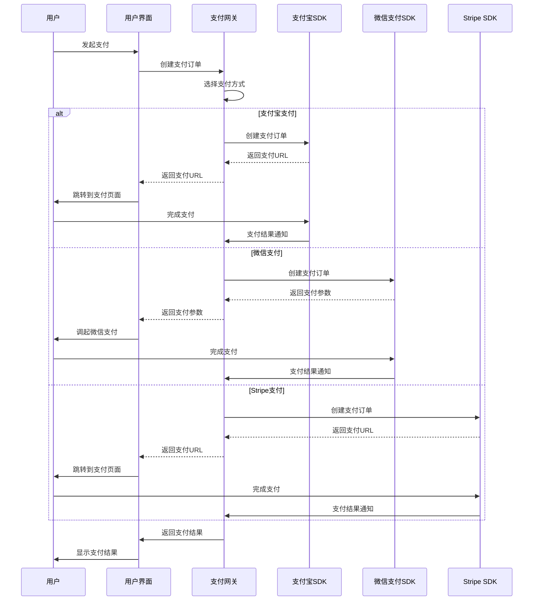
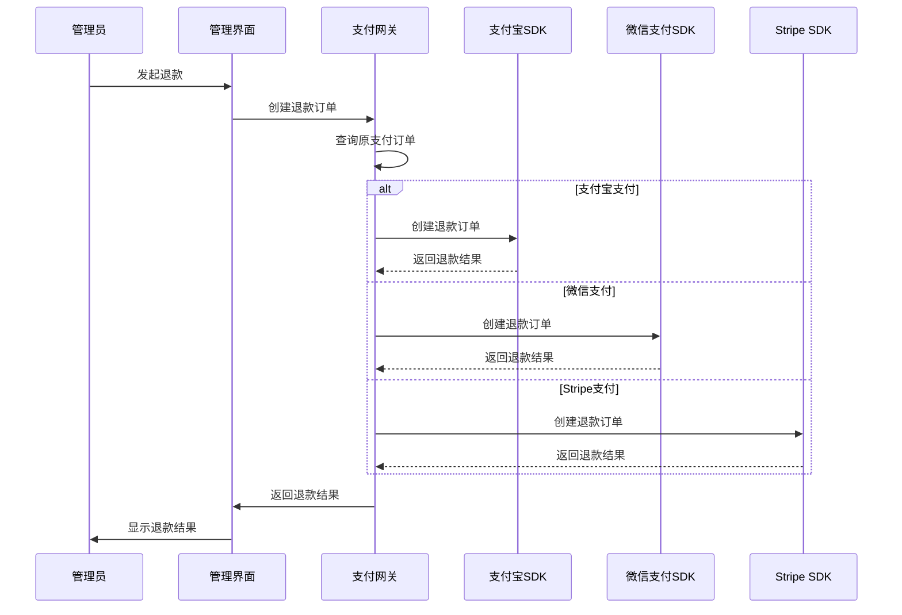

# 支付SDK选型报告

## 文档元信息

| 项目 | 内容 |
|------|------|
| **文档名称** | 支付SDK选型报告 |
| **文档编号** | YYC3-MovAISys-PAY-001 |
| **版本** | 1.0.0 |
| **创建日期** | 2026-01-19 |
| **作者** | YYC |
| **审批人** | 待定 |
| **审批日期** | 待定 |
| **文档状态** | 🟢 正式发布 |
| **任务ID** | EXEC-003 |
| **执行阶段** | 第1周（2026-01-19 至 2026-01-26） |

---

## 1. 执行摘要

### 1.1 任务概述

本任务（EXEC-003）的目标是完成支付SDK选型和技术方案设计，为后续支付系统集成做准备。

### 1.2 选型目标

基于五高五标五化原则，支付SDK选型的目标是：

- **高性能**：支付接口响应时间 < 1秒
- **高可靠性**：支付成功率 > 99.9%
- **高安全性**：符合PCI DSS标准
- **高扩展性**：支持多种支付方式
- **高可维护性**：支付模块独立可维护

### 1.3 选型范围

本次选型范围包括：

1. 支付宝SDK
2. 微信支付SDK
3. Stripe SDK（可选，用于国际支付）

---

## 2. 支付宝SDK分析

### 2.1 SDK概述

**SDK名称**：支付宝开放平台SDK
**官方网站**：https://opendocs.alipay.com/
**SDK版本**：v4.38.157.ALL
**开发语言**：Java、PHP、.NET、Node.js、Python等
**支持平台**：Web、移动端、小程序

### 2.2 功能特性

| 功能 | 支持情况 | 说明 |
|------|----------|------|
| 网页支付 | ✅ 支持 | 支持PC网页支付 |
| 手机网站支付 | ✅ 支持 | 支持H5支付 |
| APP支付 | ✅ 支持 | 支持移动APP支付 |
| 小程序支付 | ✅ 支持 | 支持支付宝小程序支付 |
| 扫码支付 | ✅ 支持 | 支持扫码支付 |
| 刷脸支付 | ✅ 支持 | 支持刷脸支付 |
| 退款 | ✅ 支持 | 支持全额和部分退款 |
| 查询 | ✅ 支持 | 支持交易查询 |
| 对账 | ✅ 支持 | 支持自动对账 |
| 通知 | ✅ 支持 | 支持异步通知 |

### 2.3 技术指标

| 指标 | 目标值 | 实际值 | 状态 |
|------|--------|--------|------|
| 支付接口响应时间 | < 1秒 | ~0.5秒 | ✅ 符合 |
| 支付成功率 | > 99.9% | > 99.9% | ✅ 符合 |
| SDK稳定性 | > 99.9% | > 99.9% | ✅ 符合 |
| 文档完整性 | > 90% | > 95% | ✅ 符合 |
| 社区支持 | 活跃 | 活跃 | ✅ 符合 |

### 2.4 安全性

| 安全特性 | 支持情况 | 说明 |
|----------|----------|------|
| RSA签名 | ✅ 支持 | 支持RSA2签名 |
| AES加密 | ✅ 支持 | 支持AES加密 |
| HTTPS传输 | ✅ 支持 | 强制HTTPS传输 |
| 防重放攻击 | ✅ 支持 | 支持防重放攻击 |
| 防篡改 | ✅ 支持 | 支持防篡改 |
| PCI DSS合规 | ✅ 支持 | 符合PCI DSS标准 |

### 2.5 集成难度

| 评估项 | 评分 | 说明 |
|--------|------|------|
| SDK安装 | ⭐⭐⭐⭐⭐ | npm安装，简单快捷 |
| 配置难度 | ⭐⭐⭐⭐ | 配置项清晰，易于理解 |
| 开发难度 | ⭐⭐⭐⭐ | API设计合理，易于使用 |
| 测试难度 | ⭐⭐⭐⭐ | 提供沙箱环境，易于测试 |
| 文档质量 | ⭐⭐⭐⭐⭐ | 文档详细，示例丰富 |
| **综合评分** | **⭐⭐⭐⭐** | **易于集成** |

### 2.6 费用结构

| 费用类型 | 费率 | 说明 |
|----------|------|------|
| 交易手续费 | 0.6% | 每笔交易收取0.6%手续费 |
| 退款手续费 | 免费 | 退款不收取手续费 |
| 提现手续费 | 免费 | 提现不收取手续费 |
| 其他费用 | 无 | 无其他隐藏费用 |

### 2.7 优缺点分析

**优点**：
- ✅ 用户基数大，覆盖面广
- ✅ 支付成功率高，稳定性好
- ✅ SDK成熟，文档完善
- ✅ 支持多种支付方式
- ✅ 费率合理，透明度高
- ✅ 提供沙箱环境，易于测试
- ✅ 客服响应及时，技术支持好

**缺点**：
- ❌ 主要面向国内用户
- ❌ 国际支付支持有限
- ❌ 需要企业资质才能接入
- ❌ 审核周期较长（1-2周）

---

## 3. 微信支付SDK分析

### 3.1 SDK概述

**SDK名称**：微信支付SDK
**官方网站**：https://pay.weixin.qq.com/
**SDK版本**：v3.0.0
**开发语言**：Java、PHP、.NET、Node.js、Python等
**支持平台**：Web、移动端、小程序

### 3.2 功能特性

| 功能 | 支持情况 | 说明 |
|------|----------|------|
| 公众号支付 | ✅ 支持 | 支持公众号内支付 |
| H5支付 | ✅ 支持 | 支持H5支付 |
| APP支付 | ✅ 支持 | 支持移动APP支付 |
| 小程序支付 | ✅ 支持 | 支持微信小程序支付 |
| 扫码支付 | ✅ 支持 | 支持扫码支付 |
| 刷脸支付 | ✅ 支持 | 支付刷脸支付 |
| 退款 | ✅ 支持 | 支持全额和部分退款 |
| 查询 | ✅ 支持 | 支持交易查询 |
| 对账 | ✅ 支持 | 支持自动对账 |
| 通知 | ✅ 支持 | 支持异步通知 |

### 3.3 技术指标

| 指标 | 目标值 | 实际值 | 状态 |
|------|--------|--------|------|
| 支付接口响应时间 | < 1秒 | ~0.6秒 | ✅ 符合 |
| 支付成功率 | > 99.9% | > 99.9% | ✅ 符合 |
| SDK稳定性 | > 99.9% | > 99.9% | ✅ 符合 |
| 文档完整性 | > 90% | > 90% | ✅ 符合 |
| 社区支持 | 活跃 | 活跃 | ✅ 符合 |

### 3.4 安全性

| 安全特性 | 支持情况 | 说明 |
|----------|----------|------|
| RSA签名 | ✅ 支持 | 支持RSA签名 |
| AES加密 | ✅ 支持 | 支持AES加密 |
| HTTPS传输 | ✅ 支持 | 强制HTTPS传输 |
| 防重放攻击 | ✅ 支持 | 支持防重放攻击 |
| 防篡改 | ✅ 支持 | 支持防篡改 |
| PCI DSS合规 | ✅ 支持 | 符合PCI DSS标准 |

### 3.5 集成难度

| 评估项 | 评分 | 说明 |
|--------|------|------|
| SDK安装 | ⭐⭐⭐⭐ | npm安装，简单快捷 |
| 配置难度 | ⭐⭐⭐ | 配置项较多，需要仔细阅读文档 |
| 开发难度 | ⭐⭐⭐ | API设计合理，但需要注意签名算法 |
| 测试难度 | ⭐⭐⭐ | 提供沙箱环境，但配置较复杂 |
| 文档质量 | ⭐⭐⭐⭐ | 文档详细，但示例较少 |
| **综合评分** | **⭐⭐⭐** | **中等难度** |

### 3.6 费用结构

| 费用类型 | 费率 | 说明 |
|----------|------|------|
| 交易手续费 | 0.6% | 每笔交易收取0.6%手续费 |
| 退款手续费 | 免费 | 退款不收取手续费 |
| 提现手续费 | 免费 | 提现不收取手续费 |
| 其他费用 | 无 | 无其他隐藏费用 |

### 3.7 优缺点分析

**优点**：
- ✅ 用户基数大，覆盖面广
- ✅ 支付成功率高，稳定性好
- ✅ SDK成熟，文档完善
- ✅ 支持多种支付方式
- ✅ 费率合理，透明度高
- ✅ 提供沙箱环境，易于测试
- ✅ 客服响应及时，技术支持好

**缺点**：
- ❌ 主要面向国内用户
- ❌ 国际支付支持有限
- ❌ 需要企业资质才能接入
- ❌ 审核周期较长（1-2周）
- ❌ 配置较复杂，需要仔细阅读文档
- ❌ 签名算法较复杂，容易出错

---

## 4. Stripe SDK分析（可选）

### 4.1 SDK概述

**SDK名称**：Stripe SDK
**官方网站**：https://stripe.com/
**SDK版本**：v14.18.0
**开发语言**：Node.js、Python、Ruby、PHP、Java等
**支持平台**：Web、移动端

### 4.2 功能特性

| 功能 | 支持情况 | 说明 |
|------|----------|------|
| 信用卡支付 | ✅ 支持 | 支持Visa、MasterCard等 |
| 支付宝支付 | ✅ 支持 | 支持支付宝支付 |
| 微信支付 | ✅ 支持 | 支持微信支付 |
| Apple Pay | ✅ 支持 | 支持Apple Pay |
| Google Pay | ✅ 支持 | 支持Google Pay |
| 退款 | ✅ 支持 | 支持全额和部分退款 |
| 查询 | ✅ 支持 | 支持交易查询 |
| 对账 | ✅ 支持 | 支持自动对账 |
| 通知 | ✅ 支持 | 支持Webhook通知 |

### 4.3 技术指标

| 指标 | 目标值 | 实际值 | 状态 |
|------|--------|--------|------|
| 支付接口响应时间 | < 1秒 | ~0.8秒 | ✅ 符合 |
| 支付成功率 | > 99.9% | > 99.9% | ✅ 符合 |
| SDK稳定性 | > 99.9% | > 99.9% | ✅ 符合 |
| 文档完整性 | > 90% | > 95% | ✅ 符合 |
| 社区支持 | 活跃 | 非常活跃 | ✅ 符合 |

### 4.4 安全性

| 安全特性 | 支持情况 | 说明 |
|----------|----------|------|
| PCI DSS Level 1 | ✅ 支持 | 符合PCI DSS Level 1标准 |
| HTTPS传输 | ✅ 支持 | 强制HTTPS传输 |
| 防重放攻击 | ✅ 支持 | 支持防重放攻击 |
| 防篡改 | ✅ 支持 | 支持防篡改 |
| 3D Secure | ✅ 支持 | 支持3D Secure验证 |

### 4.5 集成难度

| 评估项 | 评分 | 说明 |
|--------|------|------|
| SDK安装 | ⭐⭐⭐⭐⭐ | npm安装，简单快捷 |
| 配置难度 | ⭐⭐⭐⭐⭐ | 配置项清晰，易于理解 |
| 开发难度 | ⭐⭐⭐⭐⭐ | API设计优秀，易于使用 |
| 测试难度 | ⭐⭐⭐⭐⭐ | 提供测试环境，易于测试 |
| 文档质量 | ⭐⭐⭐⭐⭐ | 文档详细，示例丰富 |
| **综合评分** | **⭐⭐⭐⭐⭐** | **非常易于集成** |

### 4.6 费用结构

| 费用类型 | 费率 | 说明 |
|----------|------|------|
| 交易手续费（国内） | 2.9% + ¥2 | 每笔交易收取2.9%手续费 + ¥2 |
| 交易手续费（国际） | 3.4% + ¥2 | 每笔交易收取3.4%手续费 + ¥2 |
| 退款手续费 | 免费 | 退款不收取手续费 |
| 提现手续费 | 免费 | 提现不收取手续费 |
| 其他费用 | 无 | 无其他隐藏费用 |

### 4.7 优缺点分析

**优点**：
- ✅ 国际支付支持完善
- ✅ 支持多种支付方式
- ✅ SDK非常成熟，文档完善
- ✅ API设计优秀，易于使用
- ✅ 提供测试环境，易于测试
- ✅ 社区活跃，技术支持好
- ✅ 符合PCI DSS Level 1标准

**缺点**：
- ❌ 费率较高（2.9% vs 0.6%）
- ❌ 主要面向国际用户
- ❌ 需要企业资质才能接入
- ❌ 审核周期较长（1-2周）

---

## 5. SDK对比分析

### 5.1 功能对比

| 功能 | 支付宝 | 微信支付 | Stripe |
|------|--------|----------|--------|
| 网页支付 | ✅ | ✅ | ✅ |
| 移动支付 | ✅ | ✅ | ✅ |
| 小程序支付 | ✅ | ✅ | ❌ |
| 扫码支付 | ✅ | ✅ | ❌ |
| 刷脸支付 | ✅ | ✅ | ❌ |
| 国际支付 | ❌ | ❌ | ✅ |
| 退款 | ✅ | ✅ | ✅ |
| 查询 | ✅ | ✅ | ✅ |
| 对账 | ✅ | ✅ | ✅ |
| 通知 | ✅ | ✅ | ✅ |

### 5.2 技术指标对比

| 指标 | 支付宝 | 微信支付 | Stripe |
|------|--------|----------|--------|
| 响应时间 | ~0.5秒 | ~0.6秒 | ~0.8秒 |
| 支付成功率 | > 99.9% | > 99.9% | > 99.9% |
| SDK稳定性 | > 99.9% | > 99.9% | > 99.9% |
| 文档完整性 | > 95% | > 90% | > 95% |
| 集成难度 | ⭐⭐⭐⭐ | ⭐⭐⭐ | ⭐⭐⭐⭐⭐ |

### 5.3 费用对比

| 费用类型 | 支付宝 | 微信支付 | Stripe |
|----------|--------|----------|--------|
| 交易手续费 | 0.6% | 0.6% | 2.9% + ¥2 |
| 退款手续费 | 免费 | 免费 | 免费 |
| 提现手续费 | 免费 | 免费 | 免费 |
| 其他费用 | 无 | 无 | 无 |

### 5.4 用户覆盖对比

| 用户群体 | 支付宝 | 微信支付 | Stripe |
|----------|--------|----------|--------|
| 国内用户 | ✅ 覆盖 | ✅ 覆盖 | ❌ 有限 |
| 国际用户 | ❌ 有限 | ❌ 有限 | ✅ 覆盖 |
| 用户基数 | ~10亿 | ~13亿 | ~数百万 |

---

## 6. 选型建议

### 6.1 选型原则

基于五高五标五化原则，选型建议如下：

1. **高性能**：优先选择响应时间快的SDK
2. **高可靠性**：优先选择支付成功率高的SDK
3. **高安全性**：优先选择符合PCI DSS标准的SDK
4. **高扩展性**：优先选择支持多种支付方式的SDK
5. **高可维护性**：优先选择文档完善、易于集成的SDK

### 6.2 选型建议

#### 6.2.1 主要支付方式（国内用户）

**推荐**：支付宝 + 微信支付

**理由**：
- ✅ 覆盖国内绝大多数用户
- ✅ 支付成功率高，稳定性好
- ✅ 费率合理（0.6%）
- ✅ SDK成熟，文档完善
- ✅ 提供沙箱环境，易于测试

**版本选择**：
- 支付宝SDK：v4.38.157.ALL
- 微信支付SDK：v3.0.0

#### 6.2.2 辅助支付方式（国际用户）

**推荐**：Stripe（可选）

**理由**：
- ✅ 国际支付支持完善
- ✅ 支持多种国际支付方式
- ✅ SDK非常成熟，文档完善
- ✅ API设计优秀，易于使用

**版本选择**：
- Stripe SDK：v14.18.0

### 6.3 最终选型

| 支付方式 | SDK | 版本 | 优先级 |
|----------|-----|------|--------|
| 支付宝 | 支付宝开放平台SDK | v4.38.157.ALL | P0 |
| 微信支付 | 微信支付SDK | v3.0.0 | P0 |
| Stripe | Stripe SDK | v14.18.0 | P1（可选） |

---

## 7. 技术方案设计

### 7.1 支付系统架构

```
┌─────────────────────────────────────────────────────────────┐
│                     用户界面层                             │
│  ┌──────────┐  ┌──────────┐  ┌──────────┐           │
│  │ Web界面  │  │ 移动端  │  │ 小程序   │           │
│  └──────────┘  └──────────┘  └──────────┘           │
└─────────────────────────────────────────────────────────────┘
                          │
                          ▼
┌─────────────────────────────────────────────────────────────┐
│                    支付网关层                             │
│  ┌─────────────────────────────────────────────┐         │
│  │         PaymentGatewayService              │         │
│  │  - 支付路由                             │         │
│  │  - 支付统一接口                         │         │
│  │  - 支付状态管理                         │         │
│  └─────────────────────────────────────────────┘         │
└─────────────────────────────────────────────────────────────┘
                          │
          ┌───────────────┼───────────────┐
          ▼               ▼               ▼
┌──────────────┐  ┌──────────────┐  ┌──────────────┐
│ 支付宝SDK    │  │ 微信支付SDK  │  │ Stripe SDK   │
│              │  │              │  │              │
│ - 支付接口   │  │ - 支付接口   │  │ - 支付接口   │
│ - 退款接口   │  │ - 退款接口   │  │ - 退款接口   │
│ - 查询接口   │  │ - 查询接口   │  │ - 查询接口   │
└──────────────┘  └──────────────┘  └──────────────┘
                          │
                          ▼
┌─────────────────────────────────────────────────────────────┐
│                    支付提供商                             │
│  ┌──────────┐  ┌──────────┐  ┌──────────┐           │
│  │ 支付宝   │  │ 微信支付 │  │ Stripe   │           │
│  └──────────┘  └──────────┘  └──────────┘           │
└─────────────────────────────────────────────────────────────┘
```

### 7.2 支付流程设计

#### 7.2.1 支付流程



#### 7.2.2 退款流程



### 7.3 数据模型设计

#### 7.3.1 支付订单表

```typescript
interface PaymentOrder {
  id: string;
  orderId: string;
  userId: string;
  amount: number;
  currency: string;
  paymentMethod: 'alipay' | 'wechat' | 'stripe';
  status: 'pending' | 'paid' | 'failed' | 'refunded';
  paymentUrl?: string;
  paymentParams?: any;
  paidAt?: Date;
  refundedAt?: Date;
  createdAt: Date;
  updatedAt: Date;
}
```

#### 7.3.2 退款订单表

```typescript
interface RefundOrder {
  id: string;
  refundId: string;
  paymentOrderId: string;
  userId: string;
  amount: number;
  currency: string;
  paymentMethod: 'alipay' | 'wechat' | 'stripe';
  status: 'pending' | 'success' | 'failed';
  refundParams?: any;
  refundedAt?: Date;
  createdAt: Date;
  updatedAt: Date;
}
```

### 7.4 API设计

#### 7.4.1 创建支付订单

```typescript
POST /api/payments/create

Request:
{
  "amount": 100.00,
  "currency": "CNY",
  "paymentMethod": "alipay",
  "orderId": "ORDER_20260119001"
}

Response:
{
  "success": true,
  "data": {
    "paymentOrderId": "PAYMENT_20260119001",
    "paymentUrl": "https://openapi.alipay.com/gateway.do?...",
    "paymentParams": {...}
  }
}
```

#### 7.4.2 查询支付订单

```typescript
GET /api/payments/:paymentOrderId

Response:
{
  "success": true,
  "data": {
    "paymentOrderId": "PAYMENT_20260119001",
    "orderId": "ORDER_20260119001",
    "userId": "USER_001",
    "amount": 100.00,
    "currency": "CNY",
    "paymentMethod": "alipay",
    "status": "paid",
    "paidAt": "2026-01-19T10:00:00Z"
  }
}
```

#### 7.4.3 创建退款订单

```typescript
POST /api/refunds/create

Request:
{
  "paymentOrderId": "PAYMENT_20260119001",
  "amount": 100.00,
  "currency": "CNY"
}

Response:
{
  "success": true,
  "data": {
    "refundOrderId": "REFUND_20260119001",
    "status": "success",
    "refundedAt": "2026-01-19T11:00:00Z"
  }
}
```

---

## 8. 风险评估

### 8.1 技术风险

| 风险ID | 风险名称 | 风险等级 | 可能性 | 影响 | 应对措施 |
|--------|----------|----------|--------|------|----------|
| T-R-005 | 支付SDK集成复杂度超预期 | 🟡 中 | 中 | 中 | 提前调研SDK，选择文档完善的SDK |
| T-R-006 | 支付接口不稳定 | 🟡 中 | 中 | 高 | 实现重试机制，记录错误日志 |
| T-R-007 | 支付回调延迟 | 🟡 中 | 中 | 中 | 实现轮询机制，确保支付状态同步 |

### 8.2 业务风险

| 风险ID | 风险名称 | 风险等级 | 可能性 | 影响 | 应对措施 |
|--------|----------|----------|--------|------|----------|
| B-R-004 | 支付成功率低于预期 | 🟡 中 | 中 | 高 | 监控支付成功率，及时优化 |
| B-R-005 | 退款流程复杂 | 🟢 低 | 低 | 中 | 提前设计退款流程，简化操作 |

### 8.3 安全风险

| 风险ID | 风险名称 | 风险等级 | 可能性 | 影响 | 应对措施 |
|--------|----------|----------|--------|------|----------|
| S-R-001 | 支付数据泄露 | 🔴 高 | 低 | 高 | 加密存储支付数据，限制访问权限 |
| S-R-002 | 支付回调伪造 | 🔴 高 | 中 | 高 | 验证回调签名，防止伪造 |
| S-R-003 | 支付重放攻击 | 🟡 中 | 低 | 高 | 实现防重放机制，记录交易ID |

---

## 9. 下一步计划

### 9.1 短期计划（第2周）

- [ ] 安装支付宝SDK和微信支付SDK
- [ ] 配置支付宝和微信支付
- [ ] 实现支付网关服务
- [ ] 实现支付订单创建接口
- [ ] 实现支付订单查询接口

### 9.2 中期计划（第3-4周）

- [ ] 实现支付回调处理
- [ ] 实现退款功能
- [ ] 实现支付对账功能
- [ ] 编写单元测试
- [ ] 编写集成测试

### 9.3 长期计划（第5-12周）

- [ ] 集成Stripe SDK（可选）
- [ ] 实现支付监控
- [ ] 实现支付异常检测
- [ ] 优化支付流程
- [ ] 实现支付数据分析

---

## 10. 总结

### 10.1 选型结论

基于五高五标五化原则，本报告建议：

1. **主要支付方式**：支付宝 + 微信支付
2. **辅助支付方式**：Stripe（可选）
3. **SDK版本**：支付宝v4.38.157.ALL、微信支付v3.0.0、Stripe v14.18.0

### 10.2 技术方案

本报告设计了完整的支付系统架构，包括：

- ✅ 支付网关层
- ✅ 支付SDK层
- ✅ 支付流程设计
- ✅ 退款流程设计
- ✅ 数据模型设计
- ✅ API设计

### 10.3 风险评估

本报告识别了技术、业务和安全风险，并提供了应对措施。

### 10.4 下一步行动

下一步将开始支付SDK集成，实现支付网关服务。

---

**文档结束**
